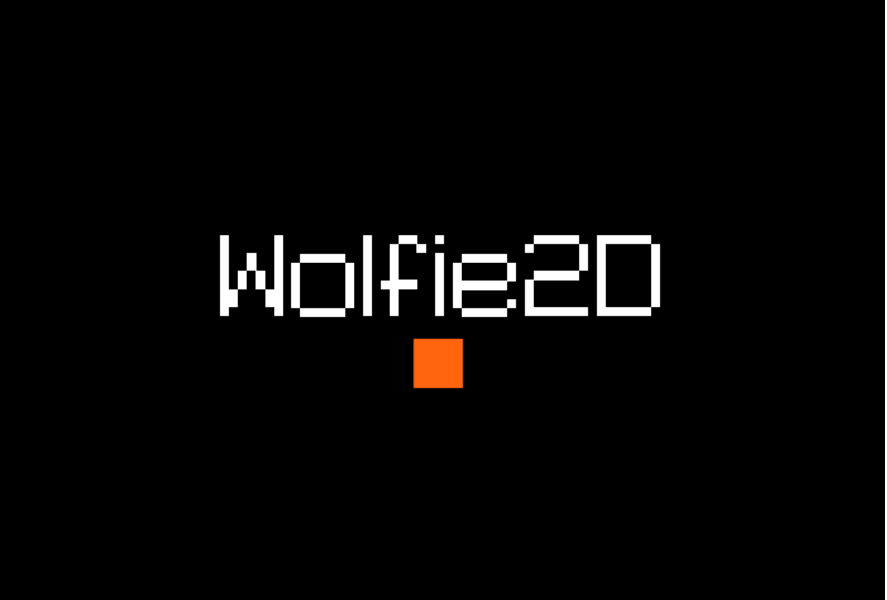

# Wolfie2D
Welcome to the official documentation for Wolfie2D! Wolfie2D is a web-based game engine written in Typescript. The goal of this website is to provide useful documentation, diagrams, and guides to help get started with Wolfie2D. 

</img>
</img>
</img>

### Founders
* Joe Weaver
* Richard McKenna

### Contributors
* Joe Weaver | 2020-2021 
* Zachary Grandison | 2021-2022 
* Peter Walsh | 2022-present 


## Quickstart
If you're familiar with node projects setting up with Wolfie2D should be straightforward. You can download the project files with the latest version of the Wolfie2D game-engine from the download link.

> The zip file found at the download link on this page is **NOT** the same as the code in the main branch of the Wolfie2D repository on GitHub. If you're trying to make a game with Wolfie2D, then download Wolfie2D from the download link. The zip file at the download link excludes many of the files used to build, test, and document Wolfie2D. 

Once you've unzip the project files and open them in a text editor like Visual Studio Code, install the project dependencies by running `npm install` in the root directory of the project. After running npm install, build the project by running `gulp` in the projects root directory. If you've run gulp successfully, the `dist` folder should contain the files

* `index.html`
* `bundle.js`

From the root direcctory of the project, the files will be located here:
```
.
├── dist
│   ├── builtin
│   ├── demo_assets
│   ├── bundle.js           <-- 
│   └── index.html          <-- 
│
├── gulpfile.js
├── package-lock.json
├── package.json
├── src
└── tsconfig.json
```

Finally, all you have to do is serve the contents of the `dist` folder to the browser. You can do this using web server for chrome or live server or an equivalent. If everything has been done correctly, you should see the default scene for Wolfie2D and be able to move the orange dot around the screen using WASD.

<p align="center"> </img> </p>


## Installation and Setup
The purpose of this tutorial is to describe the setup of a new game using Wolfie2d. This tutorial is intended for those who have never worked with Wolfie2D or a node project before. After following this tutorial, you should know how to create a simple 2D game using the Wolfie2D game-engine.

In addition, this tutorial assumes that you have some familiarity with the following technologies:
* Visual Studio Code (or equivalent text-editor)
* Node and NPM
* Web Server for Chrome (or equivalent HTTP server)


